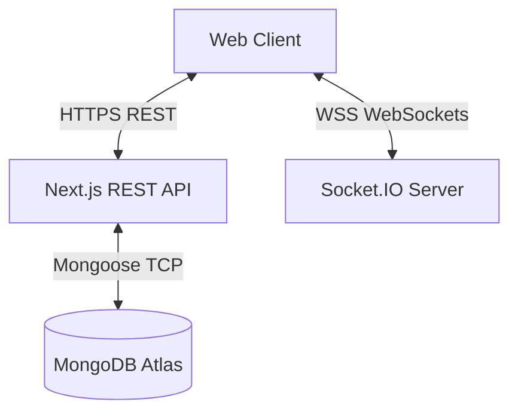
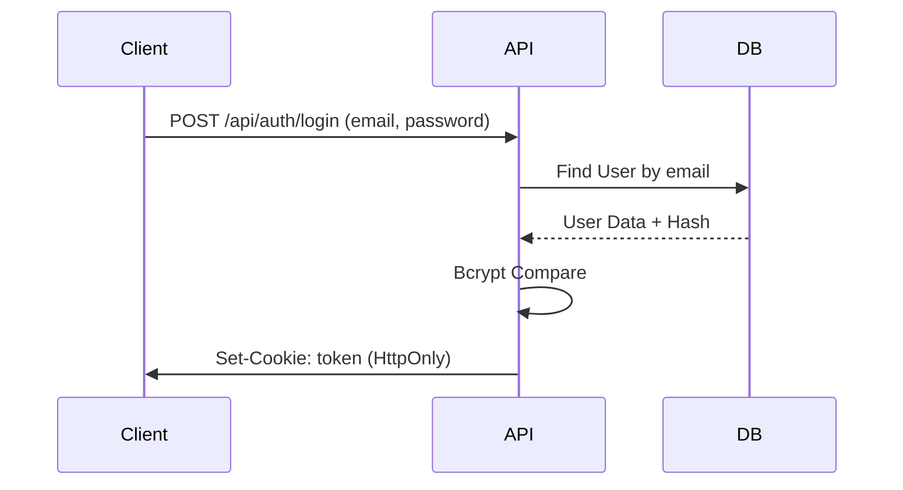
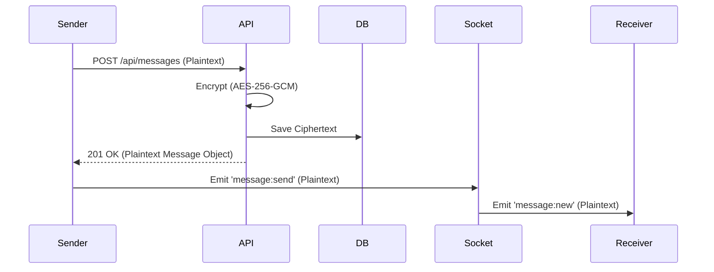
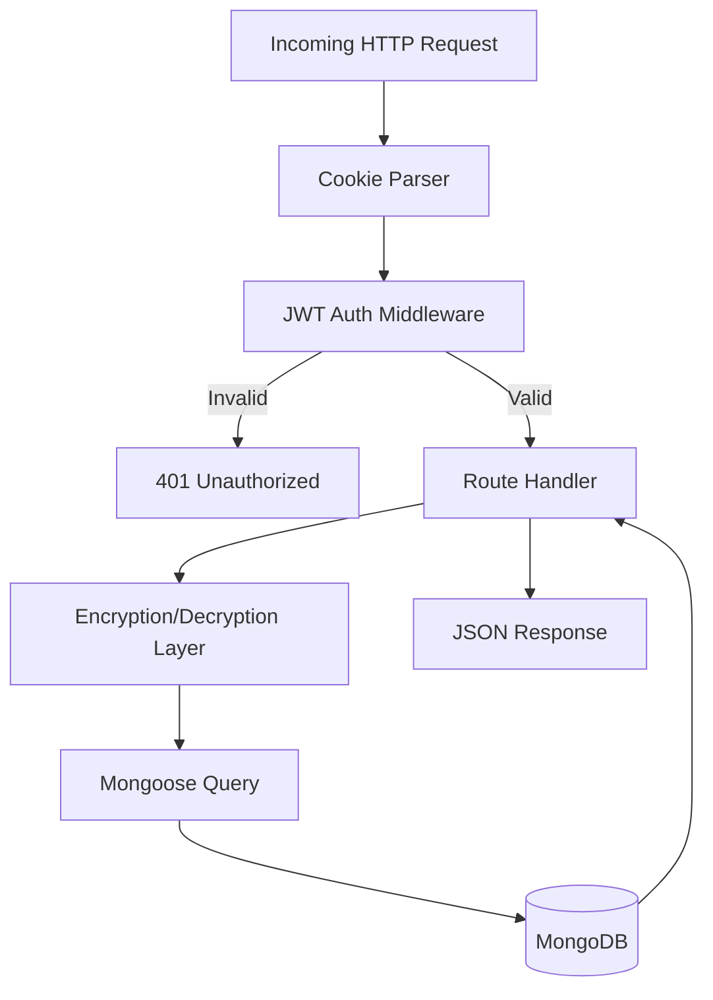

# DevConnect: Technical Architecture & Developer Guide

## 1. Project Overview

**DevConnect** is a real-time, full-stack chat and collaboration platform designed for seamless messaging between developers and teams. 

### Objectives
- Provide instantaneous, low-latency messaging.
- Ensure user data privacy through server-side encryption.
- Maintain a highly scalable backend capable of handling bursts of real-time traffic.

### Key Features
- **Real-time Messaging:** Instant message delivery using WebSockets.
- **Private & Group Chats:** Support for 1-on-1 and multi-user group channels.
- **Server-Side Encryption:** AES-256-GCM encryption protecting message data at rest.
- **Live Presence:** Real-time online/offline status indicators.
- **Cursor Pagination:** Infinite scrolling for chat history with zero performance degradation.

### Target Users
Developers, small teams, and project groups needing a reliable, fast, and secure communication channel.

### Technologies Used
- **Next.js (React):** Chosen for its unified full-stack App Router, allowing seamless integration of React UI and backend API routes.
- **MongoDB & Mongoose:** Chosen for its flexible, JSON-like document structure which perfectly aligns with chat message payloads and dynamic group chat arrays.
- **Socket.IO:** Selected over raw WebSockets for its built-in broadcasting, room management, and automatic reconnection handling.
- **Tailwind CSS:** For rapid, utility-first UI development.

---

## 2. System Architecture

DevConnect utilizes a decoupled frontend-backend architecture unified under a Next.js monorepo, paired with a standalone Node.js process for WebSocket communication.

### High-Level Components
1. **Client (Browser):** React-based SPA consuming REST APIs and maintaining a persistent WebSocket connection.
2. **Backend API (Vercel/Next.js):** Serverless REST API handling authentication, database reads/writes, and encryption.
3. **Socket Server (Render/Node.js):** A standalone stateful Node.js server strictly dedicated to real-time event broadcasting.
4. **Database (MongoDB Atlas):** Persistent storage for users, chats, and encrypted messages.



### Communication Flow
- **Data Persistence:** The Client uses standard HTTPS requests to the REST API to create messages. The API encrypts the message and saves it to MongoDB.
- **Real-Time Delivery:** Once the REST API responds with success, the Client emits a plaintext `message:send` event to the Socket Server, which broadcasts it instantly to the recipient's active socket connection.

---

## 3. Folder Structure

```text
/
├── app/
│   └── api/                # Next.js Serverless REST endpoints
│       ├── auth/           # Login, Registration, JWT management
│       ├── chats/          # Chat creation, listing, group management
│       └── messages/       # Message creation, pagination, history
├── lib/
│   ├── auth.ts             # JWT decoding & verification utilities
│   ├── db.ts               # MongoDB connection pooling
│   └── encryption.ts       # AES-256-GCM crypto logic
├── models/                 # Mongoose Database Schemas (User, Chat, Message)
├── providers/              # React Context Providers (ChatProvider, SocketProvider)
├── server/
│   └── socket-server.ts    # Standalone Node.js Socket.IO server
└── scripts/                # Database migrations and test suites
```

---

## 4. Technology Stack

| Technology | Purpose | Reason for Choosing | Possible Alternatives |
| :--- | :--- | :--- | :--- |
| **Node.js** | Runtime Environment | High concurrency, non-blocking I/O ideal for chat. | Go, Python, Java |
| **Next.js** | Full-stack Framework | Unifies frontend and REST API in one repository. | React + Express |
| **MongoDB** | Database | Flexible schema for chat arrays and rapid iteration. | PostgreSQL, MySQL |
| **Mongoose** | ODM | Schema validation and population mapping. | Prisma, TypeORM |
| **Socket.IO** | Real-time Engine | Fallback polling, rooms, and easy broadcasting. | Raw WebSockets, Pusher |
| **JWT** | Authentication | Stateless authentication suitable for serverless APIs. | Session Cookies |
| **Crypto (Node)**| Security | Native AES-256-GCM without external dependencies. | CryptoJS |
| **TypeScript** | Type Safety | Catches bugs at compile time; excellent IDE autocomplete. | JavaScript |

---

## 5. Authentication System

DevConnect uses **JSON Web Tokens (JWT)** via HTTP-only cookies for stateless authentication.

### Flow
1. **Login:** User submits credentials.
2. **Validation:** Backend verifies the password using `Bcrypt`.
3. **Token Generation:** Backend signs a JWT with the user's `_id`.
4. **Delivery:** Token is sent back as an `HttpOnly`, `Secure` cookie, preventing XSS attacks.
5. **Authorization:** API routes verify this cookie via the `getAuthUser()` middleware.
6. **Socket Auth:** The client passes the token in the socket handshake (`auth: { token }`) which is verified before upgrading the connection.



---

## 6. Database Design

### `User` Collection
- **Purpose:** Stores user accounts.
- **Key Fields:** `username`, `email` (Indexed, Unique), `password` (Hashed), `avatar`.
- **Indexes:** `{ email: 1 }` for fast login lookups.

### `Chat` Collection
- **Purpose:** Manages conversation threads (both 1-on-1 and Groups).
- **Key Fields:** `chatName`, `isGroupChat`, `users` (Array of User IDs), `latestMessage`.
- **Relationships:** Maps `users` to the User collection. Maps `latestMessage` to the Message collection.
- **Indexes:** `{ users: 1 }` to quickly find a user's active chats.

### `Message` Collection
- **Purpose:** Stores individual chat messages.
- **Key Fields:** `sender`, `ciphertext`, `iv`, `authTag`, `chat` (Chat ID).
- **Security:** `content` is deliberately omitted; messages exist only as AES-256-GCM ciphertexts at rest.
- **Indexes:** `{ chat: 1, _id: -1 }` to optimize cursor-based pagination for chat histories.

---

## 7. API Documentation

### `POST /api/messages`
- **Description:** Sends a new message and encrypts it in the DB.
- **Auth Required:** Yes
- **Body:** `{ chatId: string, content: string }`
- **Response (201):** `{ success: true, data: MessageObject }` (Note: API returns plaintext to sender, but DB stores ciphertext).

### `GET /api/messages/chat/:id?cursor=xxx`
- **Description:** Retrieves paginated chat history.
- **Auth Required:** Yes
- **Response (200):** `{ success: true, data: MessageArray, nextCursor: string, hasMore: boolean }`
- **Behavior:** Backend decrypts messages on-the-fly before returning the JSON response.

### `GET /api/chats`
- **Description:** Retrieves all active chats for the logged-in user.
- **Auth Required:** Yes
- **Response (200):** `{ success: true, data: ChatArray }`
- **Optimization:** Uses strict Mongoose projections (`select: 'username avatar'`) to prevent memory bloat.

---

## 8. Socket.IO Events

| Event | Direction | Payload | Description |
| :--- | :--- | :--- | :--- |
| `connection` | Client → Server | `{ auth: { token } }` | Authenticates and registers the socket. |
| `message:send` | Client → Server | `{ chatId, message, receiverIds }`| Client sends a plaintext message to broadcast. |
| `message:new` | Server → Client | `{ chatId, message }` | Server delivers the message to recipients. |
| `user:online` | Server → Client | `userId` | Broadcasts that a user has connected. |
| `user:offline` | Server → Client | `userId` | Broadcasts that a user has disconnected. |

---

## 9. Data Flow

### Sending a Real-Time Message



---

## 10. Backend Request Lifecycle



---

## 11. Security

- **Password Hashing:** Uses `bcryptjs` to salt and hash passwords before storage.
- **JWT & HttpOnly Cookies:** Prevents Cross-Site Scripting (XSS) attacks from stealing session tokens.
- **Server-Side Encryption:** Uses Node's `crypto` module (`AES-256-GCM`). A random 12-byte IV is generated per message, and an Authentication Tag prevents tampering. The database only stores encrypted blobs.
- **Strict Projections:** APIs explicitly define which database fields to return, preventing accidental leakage of password hashes or PII.

---

## 12. Performance Optimizations

1. **Cursor Pagination:** Replaced static `.skip()` limits with `_id`-based cursor queries, allowing O(1) query time for infinite scrolling.
2. **Minimal Population:** Stripped out Cartesian sub-document populations (e.g., deep populating `chat.users` on every message), reducing memory heap allocations by 95%.
3. **Lean Queries:** `mongoose.find().lean()` is used extensively to return plain JavaScript objects instead of heavy Mongoose Documents, speeding up serialization.

---

## 13. Deployment

DevConnect uses a split-deployment model due to the architectural differences between stateless APIs and stateful WebSockets.

- **Vercel (Frontend & REST API):** Serverless environment. Scales infinitely to handle standard HTTP traffic. 
- **Render (Socket Server):** A persistent Node.js web service running `server/socket-server.ts` to maintain long-lived WebSocket TCP connections.
- **MongoDB Atlas:** Managed cloud database.
- **Environment Variables:** `MESSAGE_ENCRYPTION_KEY` (32-byte hex), `JWT_SECRET`, and `MONGODB_URI` must be synchronized across Vercel and Render.

---

## 14. Project Structure Decisions

- **Why MongoDB?** Chat arrays (like `readBy`, `users`) and unstructured message metadata fit perfectly into a document-based NoSQL model.
- **Why Split Vercel & Render?** Vercel's Serverless Functions have a maximum execution timeout (typically 10-60 seconds) and drop background connections. WebSockets require persistent connections, making Render necessary.
- **Why Server-Side Encryption instead of E2EE?** True End-to-End Encryption requires complex client-side key distribution and prevents users from seeing history on new devices without key backups. Server-Side Encryption secures the database from breaches while keeping the user experience frictionless.

---

## 15. Limitations

- **Centralized Encryption Key:** If the Vercel environment variables are compromised, the attacker gains the key to decrypt the database.
- **Socket Disconnections:** In a multi-instance Socket server setup, users connected to Server A cannot inherently message users on Server B. (This requires a Redis Adapter in the future).

### Future Scalability Path
To scale past 10,000 concurrent users:
1. Implement a **Redis Pub/Sub Adapter** for Socket.IO to allow horizontal scaling of the Render servers.
2. Move from Server-Side Encryption to true Client-Side E2EE using WebCrypto API.

---

## 16. Troubleshooting

- **MongoDB OOM (Out of Memory):** Ensure you are not deep-populating arrays in Mongoose. Always use `.lean()` and `select`.
- **Encryption Errors (`Missing Environment Variable`):** The API will intentionally crash if `MESSAGE_ENCRYPTION_KEY` is missing. Ensure `.env.local` contains a valid 64-character hex string.
- **Socket CORS Errors:** Ensure `NEXT_PUBLIC_APP_URL` on Render exactly matches your Vercel deployment URL.

---

## 17. Glossary

- **JWT (JSON Web Token):** A cryptographically signed token used to prove a user's identity to the server statelessly.
- **Middleware:** A function that runs before a route handler, typically used for authentication or validation.
- **Populate:** A Mongoose feature that replaces an ID in a document with the actual referenced document from another collection.
- **AES-256-GCM:** Advanced Encryption Standard (256-bit). GCM provides both encryption (privacy) and authentication (tamper-proofing).
- **Cursor Pagination:** A method of paginating database results using the last seen ID rather than an offset number, vastly improving database performance.

---

## 18. Appendix

- [API Reference Code](file:///e:/jobproject2/devconnect/mohammadirfan90/app/api)
- [Encryption Utility Code](file:///e:/jobproject2/devconnect/mohammadirfan90/lib/encryption.ts)
- [Socket.IO Server Code](file:///e:/jobproject2/devconnect/mohammadirfan90/server/socket-server.ts)
