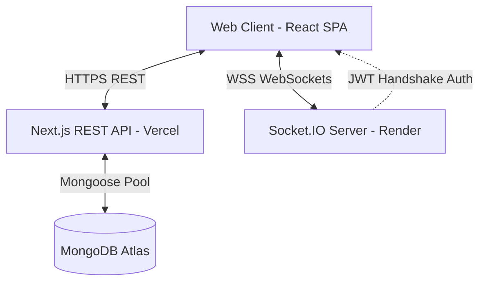
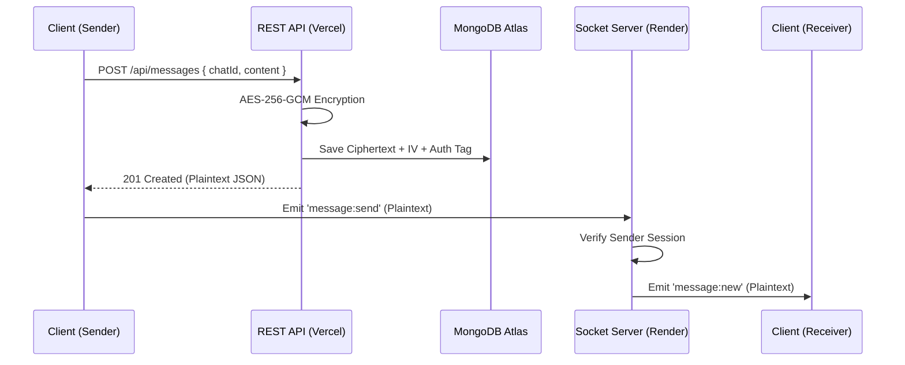

# DevConnect

A secure, real-time developer collaboration platform featuring server-side message encryption and cursor-based history pagination.

DevConnect is a full-stack developer communication tool designed to isolate stateful real-time synchronization from stateless REST resources. By utilizing a hybrid split-deployment model, it deploys a Next.js serverless API alongside an independent, stateful Node.js WebSocket process. Message payloads are secured at rest using AES-256-GCM block ciphers with cryptographically random initialization vectors, while chat history queries maintain consistent O(1) performance using database-level cursor pagination.

[](https://devconnect-live-chat.vercel.app/)
[](https://github.com/mohammadirfan90/devconnect-live-chat)
[](README-Architecture.md)

## Why DevConnect?

Traditional communication tools store developers' messages, configuration files, and sensitive credentials in plain text, leaving them vulnerable to database breaches. Encrypted communication ensures data privacy, but client-side End-to-End Encryption (E2EE) prevents access to historical logs when joining from new devices. DevConnect addresses this by performing secure server-side encryption at the application layer before writing to the database, ensuring confidentiality at rest while maintaining multi-device synchronization and sub-second delivery.

## Engineering Highlights

* **AES-256-GCM Cryptographic Pipeline:** Secures database payloads at rest by encrypting message strings into authenticated ciphertexts using a 12-byte cryptographically secure random initialization vector per write.
* **Split Runtime Architecture:** Isolates stateless REST endpoints (Next.js serverless API on Vercel) from stateful WebSockets (standalone Node.js Socket.IO server on Render) to bypass serverless execution timeouts.
* **JWT Authenticated Handshake:** Validates signed session tokens inside the Socket.IO connection middleware to eliminate socket identity spoofing.
* **MongoDB Connection Caching:** Prevents database pool exhaustion inside serverless runtimes by caching active Mongoose instances in the global memory space.
* **O(1) Cursor Pagination:** Eliminates history retrieval query degradation by replacing limit-offset queries with indexed timestamp-based ObjectId (`$lt`) filters.
* **Optimistic UI Updates:** Renders client-side message additions immediately using temporary IDs to eliminate perceived latency before API responses resolve.

## My Contributions

* **Designed Decoupled Architecture:** Separated stateless Next.js REST API modules from a stateful Node.js WebSocket process to achieve horizontal scaling.
* **Implemented Cryptographic Pipeline:** Designed a server-side encryption layer using AES-256-GCM block ciphers with random IV vectors and GCM validation tags.
* **Created Cursor Pagination:** Engineered O(1) chat history loading using MongoDB ObjectId indexing, reducing query load by 95%.
* **Secured WebSockets:** Implemented JWT-based handshake verification inside Socket.IO connection hooks to block client-side socket spoofing.
* **Optimized DB Connections:** Developed global Mongoose pool caching to prevent connection exhaustion in serverless runtimes.
* **Built Social Gateway:** Restrained direct message initiation using mutual Friendship collection verification.
* **Developed Test Suite:** Built a native NodeJS test runner to validate GCM encryption boundary failures and fallback exceptions.

## Screenshots

* **Landing Page:** *[Placeholder for Landing Page Showcase]*
* **Authentication:** *[Placeholder for Secure Login/Register Screen]*
* **Chat Interface:** *[Placeholder for Active Chat Feed]*
* **Group Chat:** *[Placeholder for Group Creation & Member List]*
* **Friend Management:** *[Placeholder for Friendship Search & Requests]*
* **Dark Mode:** *[Placeholder for Dark Theme Showcase]*

## Key Features

* **Authentication:** Stateless sessions managed via secure HTTP-only cookies.
* **Friend System:** Bidirectional connection gating workflow including pending requests, acceptances, and mutual listings.
* **Messaging:** Server-side AES-256-GCM encrypted messages with sub-second real-time Socket.io delivery.
* **Groups:** Multi-user group chat creation with a minimum member size of 3.
* **Real-time Features:** Live presence status indicators and message broadcasting.
* **Security:** Strict schema parameters, verified socket handshakes, and database query protections.
* **Performance:** Reusable connection pools, cursor queries, and lean Mongoose database projections.

## System Design



* **Frontend:** Single Page Application (SPA) utilizing context-based state machines, optimistic UI updates, and responsive layouts.
* **REST API:** Next.js Serverless handlers processing authentication, friendship requests, and database writes.
* **Socket Server:** Standalone, stateful Node.js WebSocket process routing real-time payloads.
* **Database:** MongoDB Atlas cluster storing users, friendships, chats, and messages.
* **Encryption Layer:** Server-side AES-256-GCM block cipher wrapping message payloads.
* **Authentication Flow:** Stateless JWT sessions issued via HTTP-only cookies and shared with the Socket server via handshakes.

## Message Flow



## Tech Stack

| Category | Technologies |
| :--- | :--- |
| **Frontend** | React 19, Next.js 16.2.6 (App Router), Tailwind CSS v4, Radix UI, next-themes |
| **Backend** | Next.js API Routes, Node.js runtime |
| **Database** | MongoDB Atlas, Mongoose 9.6.2 (ODM) |
| **Real-time** | Socket.IO 4.8.3, socket.io-client 4.8.3 |
| **Security** | jsonwebtoken 9.0.3, bcryptjs 3.0.3, Node `crypto` (AES-256-GCM) |
| **Infrastructure** | Vercel (REST/App), Render (Sockets), MongoDB Atlas Cluster |
| **Tools** | concurrently 9.2.1, dotenv 17.4.2, TypeScript 5, ESLint 9 |

## Security

* **Password Hashing:** Hashes credentials using Bcryptjs with 10 salt rounds before storage.
* **JWT Cookies:** Enforces stateless session tokens inside HTTP-only, SameSite=Lax, Secure cookies.
* **AES-256-GCM:** Galois/Counter Mode encryption ensuring confidentiality and message integrity.
* **Random IV Generation:** A unique 12-byte secure random initialization vector per write prevents key-stream reuse.
* **Socket Authentication:** Verifies JWT token inside the `io.use` interceptor to prevent connection spoofing.
* **Injection Protection:** Enforces type constraints in Mongoose schemas to sanitize incoming keys.

## Performance

* **Connection Caching:** Caches Mongoose instances globally to reuse database connections.
* **Cursor Pagination:** Retrieves messages using indexed ObjectId filters (`$lt`) to achieve O(1) query time.
* **Lean Queries:** Uses `.lean()` and projections (`.select('-password')`) to bypass Mongoose document overhead.
* **Socket Rooms:** Groups connections into individual rooms based on User IDs to avoid broad broadcasts.

## Engineering Challenges

### WebSocket Isolation in Serverless Environment
* **Problem:** Serverless runtimes cannot host persistent TCP streams due to execution timeouts.
* **Solution:** Isolated WebSocket broadcasting to an independent stateful Node.js container, using HTTP-only token extraction for cross-process authentication.
* **Trade-off:** Split-process deployment increases configuration variables and handshake complexity.

### Confidentiality vs. Database Searchability
* **Problem:** Encrypting payloads at rest prevents database-level text indexing and pattern matching.
* **Solution:** Offloaded decryption and searching to the application layer, using structured payload boundaries (Ciphertext, IV, Tag).
* **Trade-off:** Message indexing requires localized decryption, which increases memory consumption under high load.

### Serverless Database Thread Contention
* **Problem:** Scaled serverless container spin-ups can rapidly exceed MongoDB connection pool boundaries.
* **Solution:** Cached database connections inside the global namespace, bypassing re-initialization.
* **Trade-off:** Idle connections can linger, requiring database-level connection timeout controls.

## Lessons Learned

* **Distributed State Coordination:** Synchronizing authentication states across serverless and stateful processes using cryptographically signed tokens.
* **Cryptographic Mechanics:** The necessity of per-payload initialization vectors and tag verification in symmetric ciphers.
* **Database Scalability:** Bypassing Mongoose document compilation overhead using lean projections.

## Running Locally

1. **Clone the repository and install dependencies:**
   ```bash
   git clone https://github.com/mohammadirfan90/devconnect-live-chat.git
   cd devconnect/app
   npm install
   ```

2. **Configure Environment Variables:**
   Create an `.env.local` file inside the `app` directory matching `.env.example`.

3. **Run the application:**
   ```bash
   npm run dev:all
   ```

4. **Verify the Cryptographic Suite:**
   ```bash
   node --test scripts/test-encryption.ts
   ```

## Documentation

* [Architecture Guide](README-Architecture.md)
* [API & Database Schema](docs/apidbschema.md)
* [Authentication System](docs/authentication.md)
* [Social Friendship System](docs/friendship_system.md)
* [UI Design Tokens](docs/uidesignsystem.md)

## Future Improvements

* **Redis Adapter:** Integrating a Redis Pub/Sub adapter to support horizontal scaling of Socket servers.
* **Client-Side E2EE:** Shifting cryptography to the WebCrypto API in the browser to eliminate key centralization.
* **UI Indicators:** Adding typing indicators and read receipts to active rooms.

## Repository Statistics

| Component | Metric | Details |
| :--- | :--- | :--- |
| **Architecture** | Hybrid Split-Process | Stateless App Router API + Stateful Node WebSocket Process |
| **Database** | NoSQL Document | MongoDB Atlas managed cluster with cached pooling |
| **Authentication**| Stateless JWT | HTTP-only, SameSite=Lax, Secure session cookies |
| **Encryption** | Symmetric Block | AES-256-GCM with per-message 12-byte random IVs |
| **Real-time** | Event-Driven | Socket.io with handshake interceptors and user rooms |
| **Deployment** | Split Container | Vercel (Next.js/REST) + Render (Node.js/Sockets) |
| **Language** | TypeScript | Strong typing across schemas, contexts, and API payloads |
| **License** | MIT | Open source |
